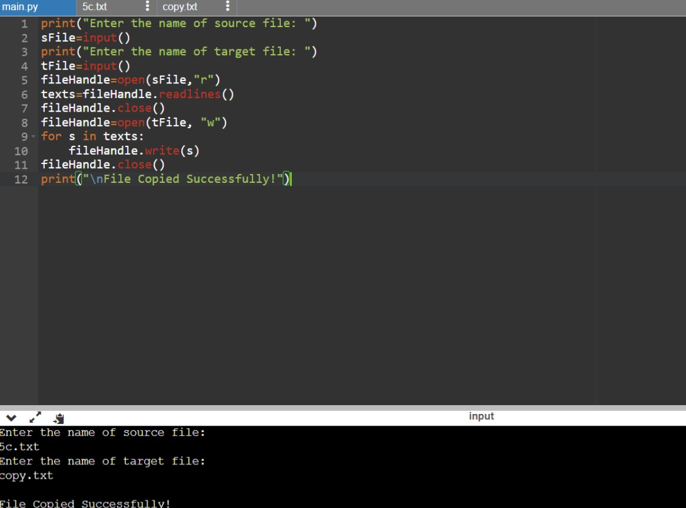

# copy-file
## AIM:
To write a python program for copying the contents from one file to another file.
## EQUIPEMENT'S REQUIRED: 
```
Hardware-PCs
Anaconda - Python 3.7
``````
## ALGORITHM: 
# Step 1:
get the file name to create user

# Step 2:
give a new file name to create a copy of a file content

# Step 3:
read the file and close the file

# Step 4:
now the content in the new filr

# Step 5:
when done print"File Copied Successfully"

# Step 6:
end the program

# PROGRAM:
```
Program to copy the file.
#Developed by: Mani Sri Latha.M
#RegisterNumber:23008627
'''
print("Enter the name of source file: ")
sFile=input()
print("Enter the name of target file: ")
tFile=input()
fileHandle=open(sFile,"r")
texts=fileHandle.readlines()
fileHandle.close()
fileHandle=open(tFile, "w")
for s in texts:
    fileHandle.write(s)
fileHandle.close()
print("\nFile Copied Successfully!")
```
### OUTPUT:



## RESULT:
Thus the program is written to copy the contents from one file to another file.